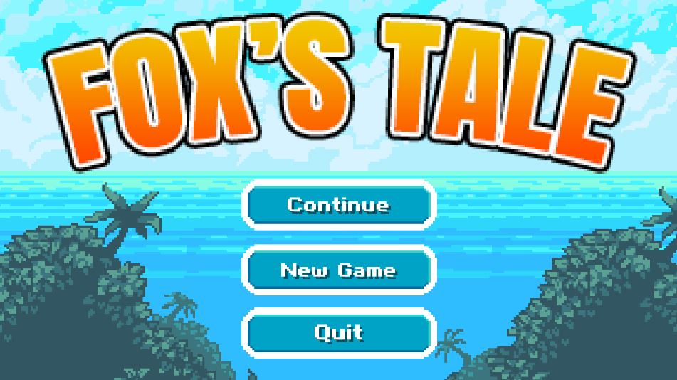
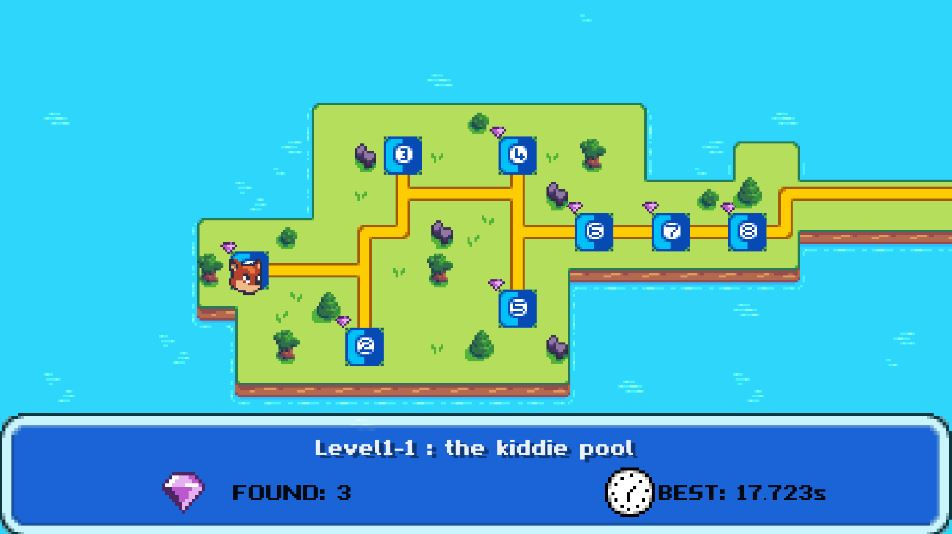
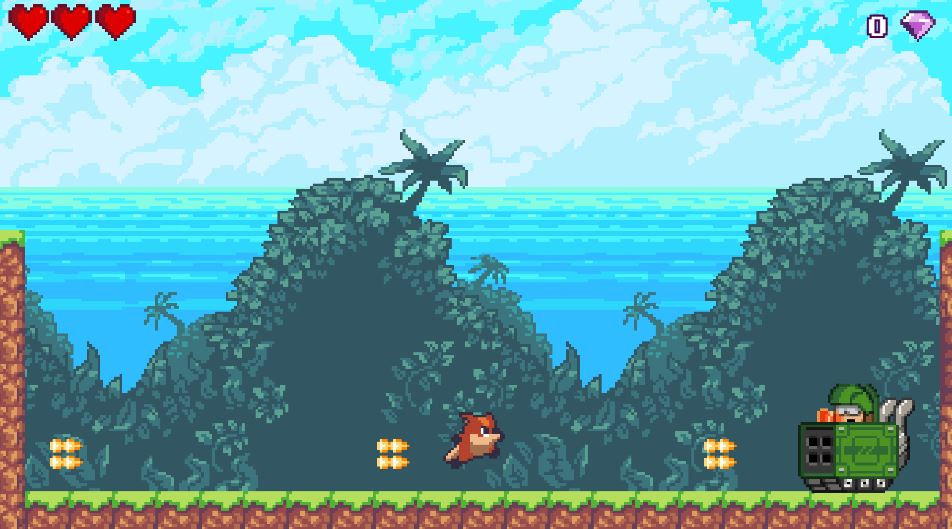

# Unity-Platformer: "Fox's Tale"

### Description
> a 2d platforming game made using the Unity engine featuring a fox that I made after taking a udemy course on the subject
>
> *Unity version: 2020.3.4f1*

# Gameplay

## Features
- Main Menu with option for continuing game
- Overworld where you select levels from (3 levels + final boss fight)
- Levels in overworld keep track of personal bests in terms of gems collected and fastest time beaten
- Levels unlock consecutively to force progression
- 2 pickups, cherries for health and gems to get high level scores
- Damage system that knocks player back, makes them intantible for a short period, and records health in the top left
- Various enemy designs from eagles that swoop down, jumping frogs, spikes, and blocks that crush you
- Final Boss with 

## Overworld

# Various enemy designs and level mechanics

## Final Boss

## How to play
- clone repository or download the **FinalBuild** folder
- run **'Fox's Tale.exe'**

